# elastic-siem-windows-log-monitoring

Hands-on Elastic SIEM lab demonstrating the deployment of Elasticsearch, Kibana, and Fleet Server on Kali Linux, along with Elastic Agent deployment on a Windows 11 virtual machine for centralized Windows log collection, monitoring, and analysis.

# Elastic SIEM Setup and Windows Endpoint Monitoring

## 📑 Table of Contents

- [📖 Project Overview](#-project-overview)
- [🎯 Objectives](#-objectives)
- [🖥️ Lab Environment](#-lab-environment)
- [🛠️ Tools Used](#-tools-used)
- [⚙️ Project Implementation](#-project-implementation)
  - [In This Project, I Used](#in-this-project-i-used)
  - [Step 1: Configure Kali Linux on VirtualBox](#step-1-configure-kali-linux-on-virtualbox)
  - [Step 2: Check Kali Linux Version](#step-2-check-kali-linux-version)
  - [Step 3: Update Kali Linux](#step-3-update-kali-linux)
  - [Step 4: Install Required Dependencies](#step-4-install-required-dependencies)
  - [Step 5: Add the Elastic Package Repository](#step-5-add-the-elastic-package-repository)
  - [Step 6: Refresh the Package List](#step-6-refresh-the-package-list)
  - [Step 7: Install Elasticsearch](#step-7-install-elasticsearch)
  - [Step 8: Enable Elasticsearch as a System Service](#step-8-enable-elasticsearch-as-a-system-service)
  - [Step 9: Start Elasticsearch](#step-9-start-elasticsearch)
  - [Step 10: Find the CA Certificate](#step-10-find-the-ca-certificate)
  - [Step 11: Test Elasticsearch](#step-11-test-elasticsearch)
  - [Step 12: Reset the Elastic Password](#step-12-reset-the-elastic-password)
  - [Step 13: Test Elasticsearch Again](#step-13-test-elasticsearch-again)
  - [Step 14: Install Kibana](#step-14-install-kibana)
  - [Step 15: Generate a Kibana Enrollment Token](#step-15-generate-a-kibana-enrollment-token)
  - [Step 16: Configure Kibana](#step-16-configure-kibana)
  - [Step 17: Configure the Kibana Server Address](#step-17-configure-the-kibana-server-address)
  - [Step 18: Enroll Kibana with Elasticsearch](#step-18-enroll-kibana-with-elasticsearch)
  - [Step 19: Enable Kibana to Start Automatically](#step-19-enable-kibana-to-start-automatically)
  - [Step 20: Start Kibana](#step-20-start-kibana)
  - [Step 21: Open Kibana in the Browser](#step-21-open-kibana-in-the-browser)
  - [Step 22: Open Fleet](#step-22-open-fleet)
  - [Step 23: Add the Fleet Encryption Key](#step-23-add-the-fleet-encryption-key)
  - [Step 24: Restart Kibana and Access Fleet](#step-24-restart-kibana-and-access-fleet)
  - [Step 25: Add a Fleet Server](#step-25-add-a-fleet-server)
  - [Step 26: Download the Correct Elastic Agent](#step-26-download-the-correct-elastic-agent)
  - [Step 27: Run the Fleet Server Installation Command](#step-27-run-the-fleet-server-installation-command)
  - [Step 28: Verify the Elastic Agent Service](#step-28-verify-the-elastic-agent-service)
  - [Step 29: Check Fleet in Kibana](#step-29-check-fleet-in-kibana)
  - [Step 30: Add the Windows 11 VM](#step-30-add-the-windows-11-vm)
  - [Step 31: Add Windows Integration](#step-31-add-windows-integration)
  - [Step 32: Add the Windows Agent](#step-32-add-the-windows-agent)
  - [Step 33: Verify the Windows Agent in Kibana](#step-33-verify-the-windows-agent-in-kibana)
  - [Step 34: Verify Windows Logs in Discover](#step-34-verify-windows-logs-in-discover)
  - [Project Implementation Conclusion](#project-implementation-conclusion)

- [🧠 Skills Earned](#-skills-earned)
- [🔑 Key Learnings](#-key-learnings)
- [✅ Conclusion](#-conclusion)

## 📖 Project Overview

This project demonstrates the implementation of a basic **Elastic SIEM lab environment** for centralized security monitoring and Windows endpoint log analysis. The lab was built using **Kali Linux** and **Windows 11** virtual machines, with Kali Linux deployed through **VirtualBox** and Windows 11 deployed through **VMware Workstation**.

The Elastic Stack was configured on the Kali Linux virtual machine, including **Elasticsearch**, **Kibana**, and **Fleet Server**. An **Elastic Agent** was then deployed and enrolled on the Windows 11 endpoint through Fleet to collect and forward Windows security telemetry.

The collected endpoint data was centralized in **Elasticsearch** and analyzed through **Kibana**, providing hands-on experience with **SIEM deployment, endpoint monitoring, centralized log collection, Fleet management, and security event analysis** in a controlled SOC lab environment.

## 🎯 Objectives

- To deploy and configure a basic **Elastic SIEM environment** using Elasticsearch, Kibana, and Fleet Server.
- To configure **Kali Linux** as the central SIEM server and **Windows 11** as the monitored endpoint.
- To enroll and manage the Windows 11 endpoint using **Elastic Agent and Fleet**.
- To collect and centralize **Windows security telemetry** for monitoring and analysis.
- To use **Kibana Discover** to search, filter, and analyze collected security events.
- To gain practical experience with **SIEM deployment, endpoint monitoring, log collection, and security event analysis**.
- To develop a practical foundation for **SOC operations and incident investigation**.

## 🖥️ Lab Environment

The lab environment was designed using two virtual machines hosted on separate virtualization platforms. **Kali Linux** was deployed using **VirtualBox** and configured as the central Elastic SIEM server, while **Windows 11** was deployed using **VMware Workstation** and configured as the monitored endpoint.

| Component | Platform | Role |
|---|---|---|
| **Kali Linux** | VirtualBox | Elastic SIEM server |
| **Windows 11** | VMware Workstation | Monitored endpoint |
| **Elasticsearch** | Kali Linux | Data storage and indexing |
| **Kibana** | Kali Linux | Visualization and security event analysis |
| **Fleet Server** | Kali Linux | Elastic Agent management |
| **Elastic Agent** | Windows 11 | Endpoint telemetry and log collection |

The Windows 11 endpoint communicated with the **Fleet Server** running on Kali Linux, which managed the Elastic Agent and facilitated endpoint data collection for analysis through **Elasticsearch** and **Kibana**.

## 🛠️ Tools Used

- **VirtualBox** — Virtualization platform used to deploy the Kali Linux virtual machine
- **Kali Linux** — SIEM server and Elastic Stack deployment environment
- **VMware Workstation** — Virtualization platform used to deploy the Windows 11 virtual machine
- **Windows 11** — Monitored endpoint for security event collection
- **Elasticsearch** — Centralized data storage and indexing
- **Kibana** — Security event visualization, search, and analysis
- **Fleet Server** — Centralized management of Elastic Agents
- **Elastic Agent** — Endpoint telemetry and log collection
- **Kibana Discover** — Log searching and security event investigation

## ⚙️ Project Implementation

### In This Project, I Used

The project was implemented using the following virtual machines and Elastic Stack components:

```text
Kali Linux (VirtualBox VM)
        │
        ├── Elasticsearch
        ├── Kibana
        └── Fleet Server
                │
                ▼
Windows 11 (VMware Workstation VM)
        │
        └── Elastic Agent
                │
                ▼
           Fleet Server
```

**Kali Linux on VirtualBox VM → Elasticsearch + Kibana + Fleet Server**

**Windows 11 on VMware Workstation VM → Elastic Agent → Fleet Server**

This lab environment was designed to demonstrate the deployment of the Elastic Stack SIEM, Fleet Server configuration, Elastic Agent enrollment, and collection of Windows security, system, and application logs.

---

### Step 1: Configure Kali Linux on VirtualBox

Kali Linux was configured as a virtual machine using **Oracle VirtualBox**. This virtual machine was used as the primary system for deploying the Elastic Stack components, including **Elasticsearch, Kibana, and Fleet Server**.

The Kali Linux virtual machine was successfully started and prepared for the subsequent stages of the project implementation.

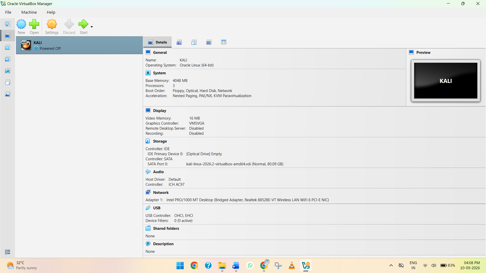

*Figure 1: Kali Linux virtual machine configured in VirtualBox.*

---

### Step 2: Check Kali Linux Version

After configuring the Kali Linux virtual machine, the operating system version was verified using the Terminal. The following command was executed:

```bash
cat /etc/os-release
```

The command displays information about the installed operating system, including its name and version. The output confirmed that the system was running **Kali Linux 2026.3 (kali-rolling)**.

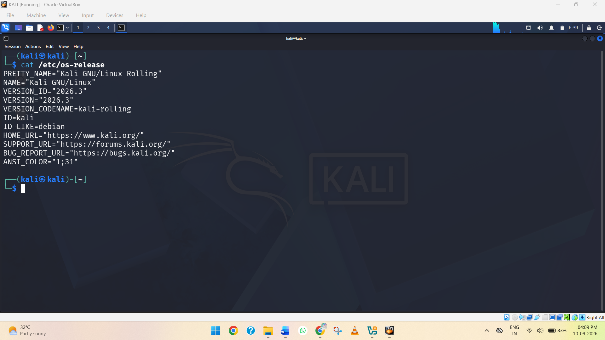

*Figure 2: Kali Linux version information displayed in the Terminal, confirming Kali Linux 2026.3 (kali-rolling).*

---

### Step 3: Update Kali Linux

Before installing **Elasticsearch and Kibana**, the Kali Linux system was updated to ensure that the package repositories and existing software packages were up to date.

The following command was executed in the Terminal:

```bash
sudo apt update && sudo apt upgrade -y
```

The `apt update` command refreshes the local package lists with the latest information from the configured repositories. The `apt upgrade -y` command then upgrades the installed packages to their latest available versions. The update and upgrade process was allowed to complete before proceeding with the Elastic Stack installation.

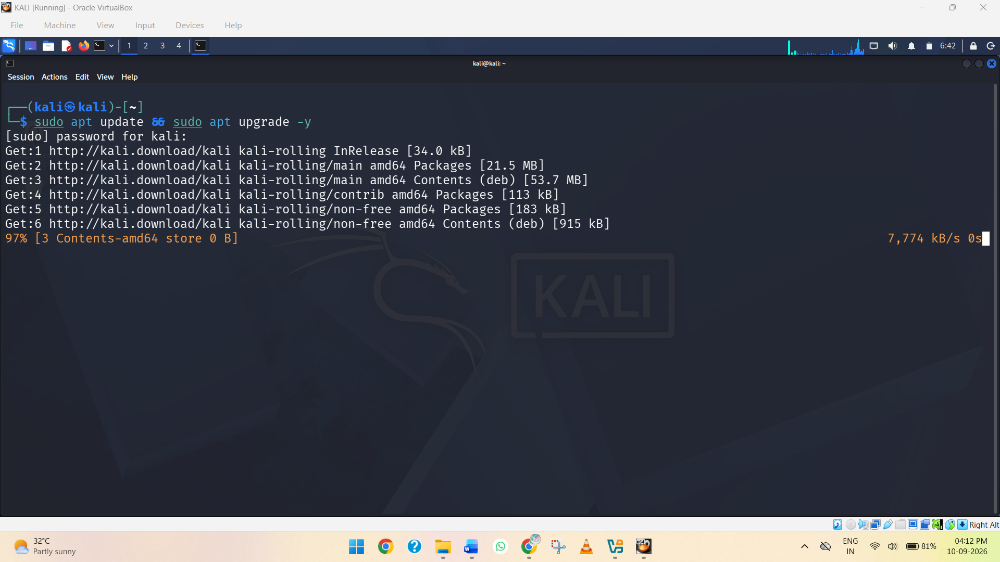

*Figure 3: Kali Linux packages being updated and upgraded through the Terminal.*

---

### Step 4: Install Required Dependencies

Before installing the Elastic Stack components, the required packages for repository configuration and package installation were installed on the Kali Linux system.

The following command was executed in the Terminal:

```bash
sudo apt install apt-transport-https wget gnupg -y
```

These packages provide the basic utilities required for the installation process. `apt-transport-https` enables package retrieval over HTTPS, `wget` is used to download files from the internet, and `gnupg` is used for handling and verifying repository signing keys.

The installation completed successfully, and the required dependencies were ready for the next stage of the Elastic Stack setup.

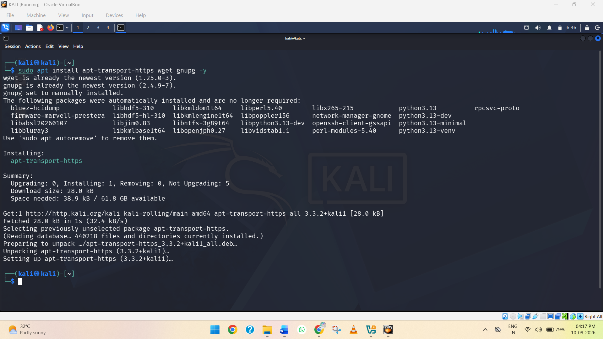

*Figure 4: Required packages successfully installed on Kali Linux using the APT package manager.*

---

### Step 5: Add the Elastic Package Repository

The official Elastic package repository was configured on the Kali Linux system. This process involved two parts: first, downloading and storing Elastic's official GPG signing key, and then adding the Elastic 9.x APT repository. This allows the system to securely download and install Elastic Stack packages through the APT package manager.

#### 5.1 Add the Elastic GPG Signing Key

The following command was executed to download Elastic's official GPG signing key and store it as a keyring:

```bash
wget -qO - https://artifacts.elastic.co/GPG-KEY-elasticsearch | sudo gpg --dearmor -o /usr/share/keyrings/elasticsearch-keyring.gpg
```

The GPG key is used by APT to verify the authenticity of packages downloaded from the Elastic repository.

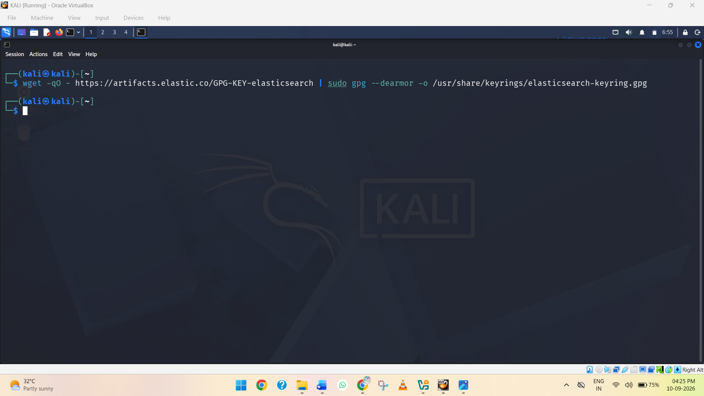

*Figure 5: Elastic's official GPG signing key being downloaded and stored as a keyring.*

#### 5.2 Add the Elastic 9.x Repository

After adding the signing key, the official Elastic 9.x APT repository was added using the following command:

```bash
echo "deb [signed-by=/usr/share/keyrings/elasticsearch-keyring.gpg] https://artifacts.elastic.co/packages/9.x/apt stable main" | sudo tee /etc/apt/sources.list.d/elastic-9.x.list
```

This creates the repository configuration file:

```text
/etc/apt/sources.list.d/elastic-9.x.list
```

The `signed-by` option specifies the Elastic GPG keyring that APT uses to verify packages obtained from the repository.

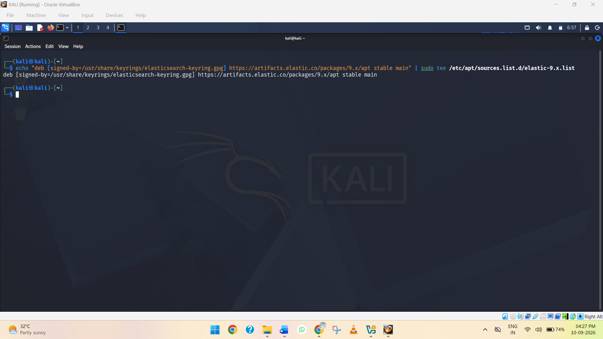

*Figure 6: Elastic 9.x APT repository successfully added to the Kali Linux package sources.*

---

### Step 6: Refresh the Package List

After adding the Elastic package repository, the APT package list was refreshed to ensure that Kali Linux could access the newly configured Elastic repository.

The following command was executed:

```bash
sudo apt update
```

During the update process, the output was checked for an entry similar to:

```text
https://artifacts.elastic.co/packages/9.x/apt stable
```

The update completed without any **GPG, signature, or repository errors**, confirming that the Elastic repository was configured correctly and was accessible through the APT package manager.

---

### Step 7: Install Elasticsearch

The next step was to install **Elasticsearch** on the Kali Linux virtual machine. Elasticsearch serves as the central data storage and indexing component of the Elastic Stack. It will store and index the security data collected from the Windows 11 endpoint through the Elastic Agent.

The following command was executed:

```bash
sudo apt install elasticsearch -y
```

The installation process may take some time to complete. During installation, Elasticsearch automatically generated a password for the built-in **`elastic` superuser account**.

The generated password was copied and stored temporarily because it is required for authentication during the subsequent configuration and setup of the Elastic Stack.

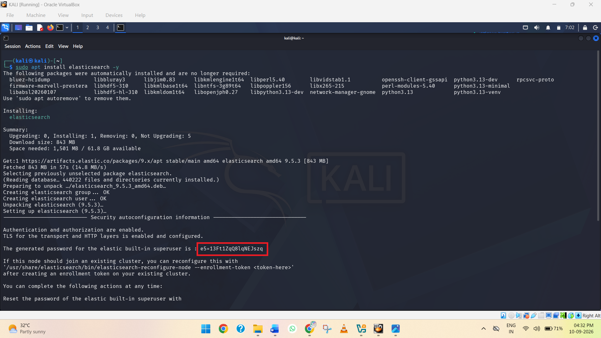

*Figure 7: Elasticsearch being installed on Kali Linux, with the automatically generated password for the built-in `elastic` superuser displayed in the Terminal.*

---

### Step 8: Enable Elasticsearch as a System Service

After installing Elasticsearch, the systemd service configuration was reloaded to ensure that the newly installed Elasticsearch service was recognized by the system.

The following command was executed:

```bash
sudo systemctl daemon-reload
```

Next, Elasticsearch was enabled as a system service so that it would **start automatically whenever the Kali Linux system boots**.

```bash
sudo systemctl enable elasticsearch.service
```

The output confirmed that the Elasticsearch service was successfully enabled. This ensures that Elasticsearch does not need to be manually started after every system restart.

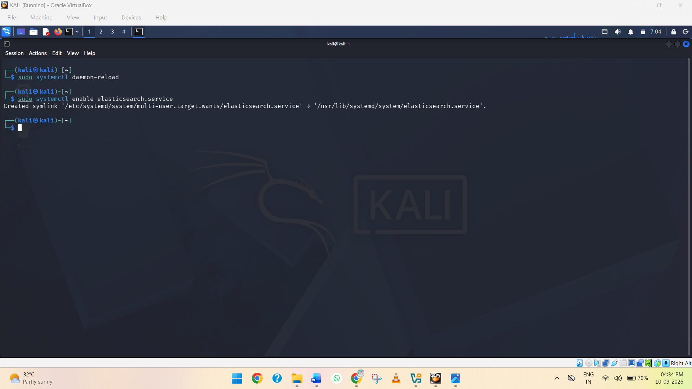

*Figure 8: Elasticsearch successfully enabled as a system service to start automatically with Kali Linux.*

---

### Step 9: Start Elasticsearch

After enabling Elasticsearch as a system service, the Elasticsearch service was started manually using the following command:

```bash
sudo systemctl start elasticsearch.service
```

The status of the service was then checked to verify that Elasticsearch was running successfully:

```bash
sudo systemctl status elasticsearch.service
```

The output was checked for the following status:

```text
Active: active (running)
```

The **active (running)** status confirms that Elasticsearch started successfully and is currently running on the Kali Linux system.

Any warnings displayed in the output were Java/Elasticsearch-related warnings and did not prevent the Elasticsearch service from running successfully.

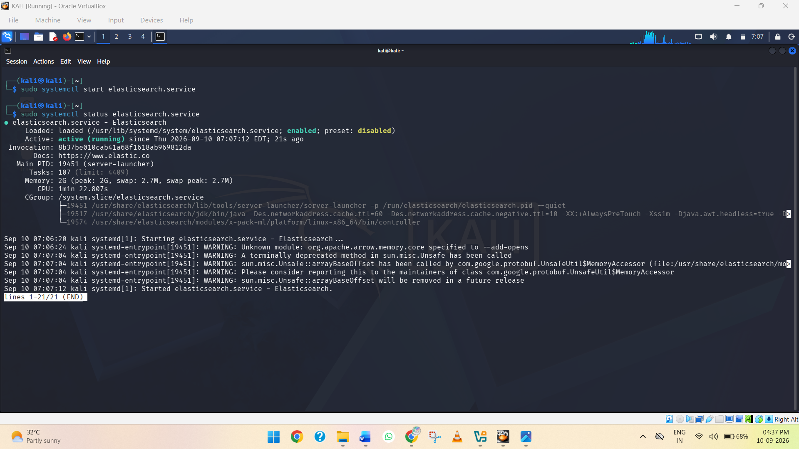

*Figure 9: Elasticsearch service status showing Active: active (running), confirming that Elasticsearch is running successfully.*

---

### Step 10: Find the CA Certificate

The next step was to locate the **Certificate Authority (CA) certificate** generated by Elasticsearch. This certificate will be required for secure communication with Elasticsearch in the subsequent configuration steps.

The following command was executed:

```bash
sudo find /etc/elasticsearch -name "http_ca.crt"
```

The command searches the Elasticsearch configuration directory for the `http_ca.crt` file and displays its exact location.

The command returned the following path:

```text
/etc/elasticsearch/certs/http_ca.crt
```

The exact path returned by the system was noted for use in the upcoming steps.

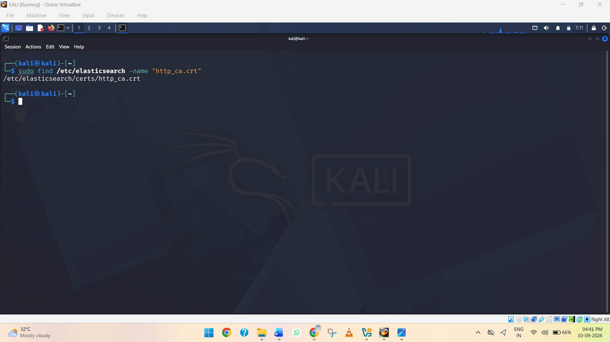

*Figure 10: Terminal output displaying the location of the Elasticsearch `http_ca.crt` CA certificate.*

---

### Step 11: Test Elasticsearch

After locating the CA certificate, Elasticsearch was tested to verify that the service was accessible over its secure HTTPS interface.

The following command was executed with root privileges:

```bash
sudo curl --cacert /etc/elasticsearch/certs/http_ca.crt -u elastic https://localhost:9200
```

The command uses the previously identified CA certificate to establish a trusted HTTPS connection with Elasticsearch running on **localhost at port 9200**. The `-u elastic` option specifies the built-in `elastic` superuser for authentication.

When prompted for the password, the **current password for the `elastic` user** was entered.

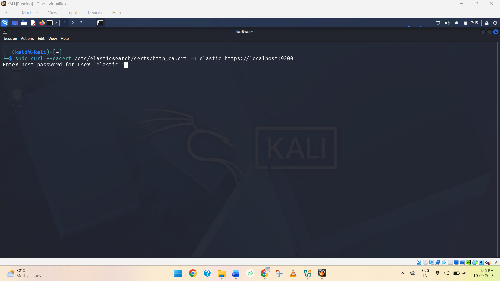

*Figure 11: Terminal prompt requesting the password for the `elastic` superuser during Elasticsearch authentication.*

---

### Step 12: Reset the `elastic` Password

The password for the built-in **`elastic` superuser** was reset to generate a new password for authentication with Elasticsearch.

The following command was executed:

```bash
sudo /usr/share/elasticsearch/bin/elasticsearch-reset-password -u elastic
```

The command displayed a confirmation prompt asking whether to continue. After confirming, Elasticsearch generated a **new password for the `elastic` user**.

The newly generated password was copied and stored temporarily because it would be required in the next step for authenticating with Elasticsearch.

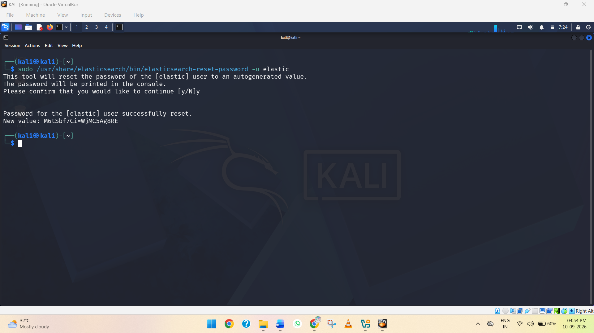

*Figure 12: Terminal output showing the password reset process and the newly generated password for the `elastic` superuser.*

---

### Step 13: Test Elasticsearch Again

After resetting the `elastic` user password, Elasticsearch was tested again to verify that the service, HTTPS connection, and authentication were working correctly.

The following command was executed:

```bash
sudo curl --cacert /etc/elasticsearch/certs/http_ca.crt -u elastic https://localhost:9200
```

When prompted:

```text
Enter host password for user 'elastic':
```

the **newly generated password** from Step 12 was entered.

The command returned a successful Elasticsearch response, confirming that the Elasticsearch API was reachable and authentication was working correctly.

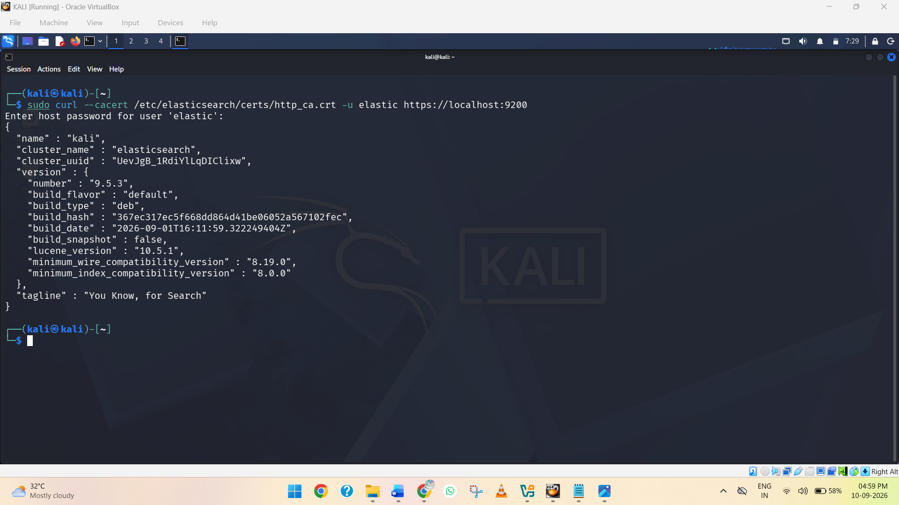

*Figure 13: Successful Elasticsearch API response showing Elasticsearch version 9.5.3, the `elasticsearch` cluster, and successful authenticated HTTPS communication.*

#### Verification

The output confirmed the following:

* **Elasticsearch version:** 9.5.3
* **Cluster name:** `elasticsearch`
* **Cluster UUID:** Generated successfully
* **Security authentication:** Working
* **HTTPS certificate:** Working
* **Elasticsearch API:** Reachable on port 9200

**Result:** Elasticsearch was successfully installed, configured, secured, and verified. The Elasticsearch component of the lab is ready for the next stage of the Elastic Stack deployment.

---

### Step 14: Install Kibana

After successfully installing and verifying Elasticsearch, the next step was to install **Kibana 9.x**. Kibana provides the web-based interface for interacting with the Elastic Stack and will be used later to view, search, analyze, and visualize the security data collected from the Windows endpoint.

The following command was executed:

```bash
sudo apt install kibana -y
```

The installation was allowed to complete. The installed version was **Kibana 9.5.3**.

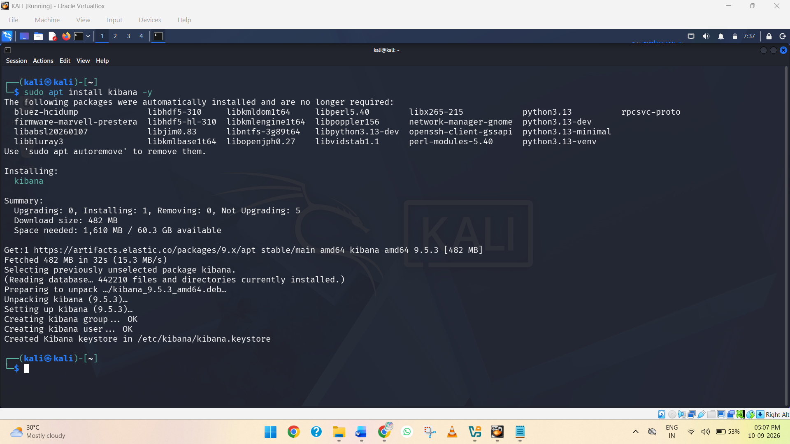

*Figure 14: Kibana 9.5.3 being installed successfully on the Kali Linux virtual machine.*

**Result:** Kibana 9.5.3 was successfully installed and is ready for configuration in the next step.

---

### Step 15: Generate a Kibana Enrollment Token

Because Elasticsearch security is enabled, a **Kibana enrollment token** was generated to securely connect Kibana with the Elasticsearch instance.

The following command was executed:

```bash
sudo /usr/share/elasticsearch/bin/elasticsearch-create-enrollment-token -s kibana
```

The command generated a long **Kibana enrollment token**. The token was copied and stored temporarily because it would be required during the Kibana configuration process in the next step.

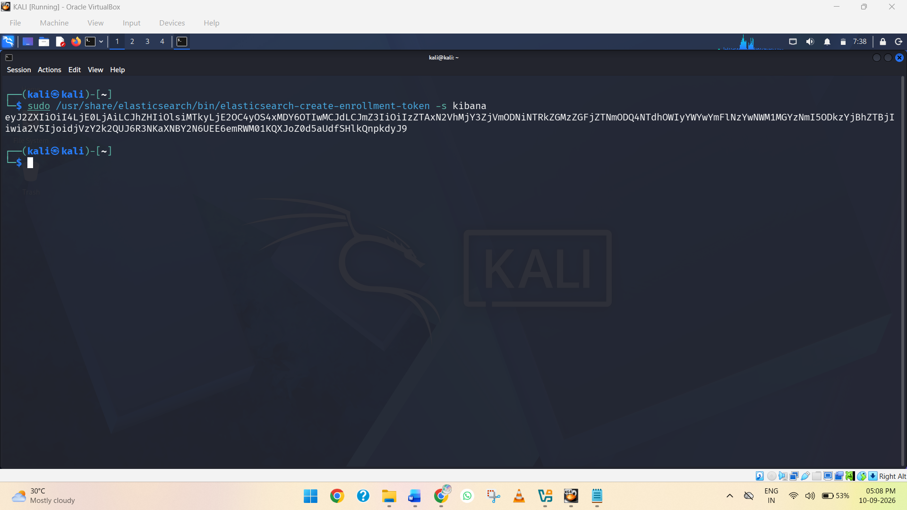

*Figure 15: Terminal output displaying the generated Kibana enrollment token.*

**Result:** The Kibana enrollment token was successfully generated and is ready to be used for the Kibana configuration.

---

### Step 16: Configure Kibana

The next step was to configure Kibana so that it can connect securely to the Elasticsearch instance.

The Kibana configuration file was opened using the following command:

```bash
sudo nano /etc/kibana/kibana.yml
```

This configuration file contains the settings required to configure Kibana, including its network address and connection details for Elasticsearch.

The file was opened in the **Nano text editor** so that the required configuration changes could be made in the following steps.

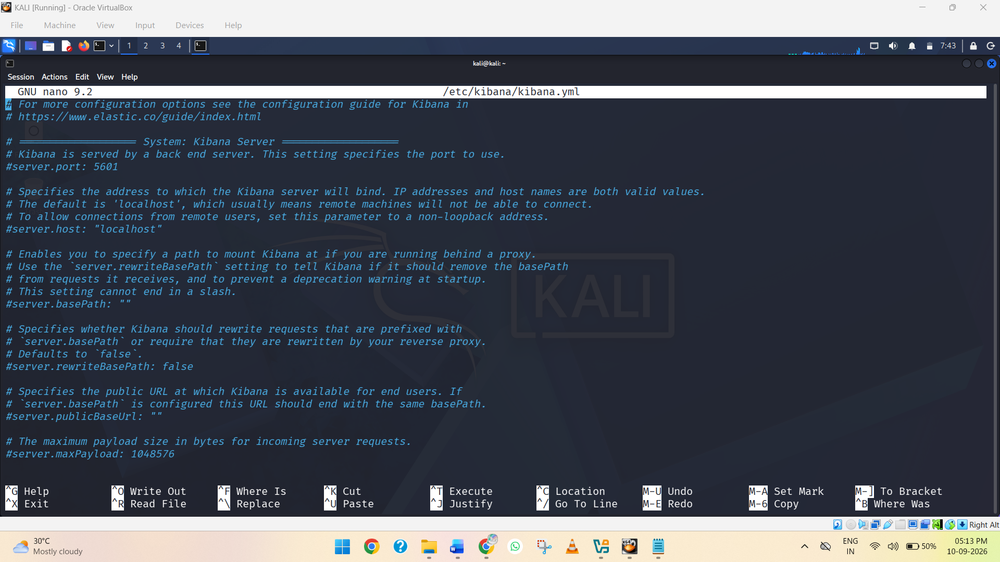

*Figure 16: Kibana configuration file `kibana.yml` opened in the Nano text editor.*

---

### Step 17: Configure the Kibana Server Address

The Kibana configuration file was modified to allow Kibana to be accessed through the lab network, including from the Windows 11 virtual machine.

The following line was located in `/etc/kibana/kibana.yml`:

```yaml
#server.host: "localhost"
```

It was changed to:

```yaml
server.host: "0.0.0.0"
```

Setting the server address to `0.0.0.0` allows Kibana to listen for connections on the available network interfaces, making it accessible from a browser on the lab network.

At this stage, the **Elasticsearch connection settings were left unchanged**. No `elasticsearch.hosts` or authentication credentials were manually added because the **Kibana enrollment token** generated in Step 14 will be used to establish the secure connection with Elasticsearch.

#### Save the Configuration

After making the change, the file was saved in Nano using:

1. Press **Ctrl + O**
2. Press **Enter** to confirm the filename
3. Press **Ctrl + X** to exit Nano

The configuration file was then closed, and no further changes were made at this stage.

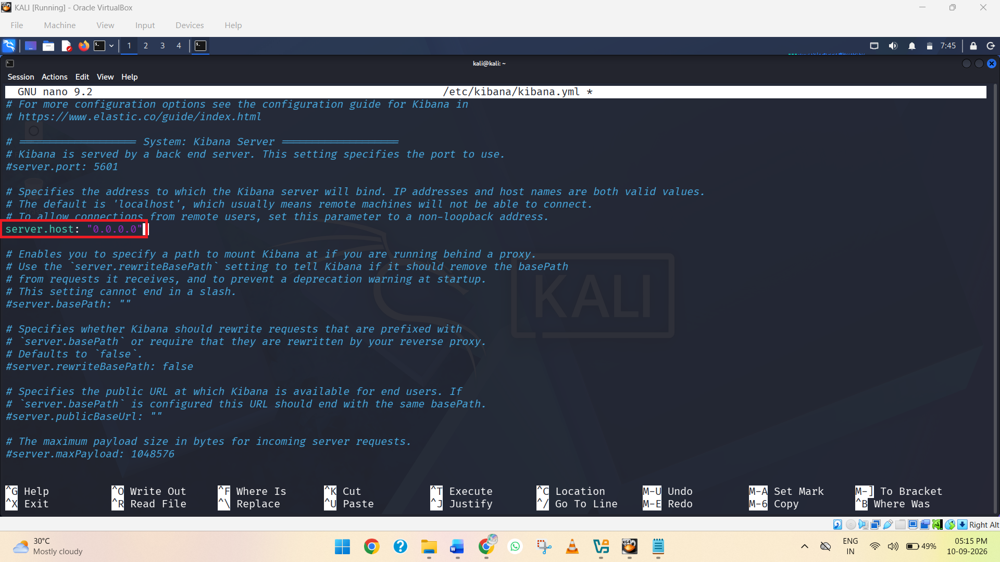

*Figure 17: Kibana configuration file showing `server.host: "0.0.0.0"` configured in `kibana.yml`.*

---

### Step 18: Enroll Kibana with Elasticsearch

The next step was to securely connect **Kibana** with the previously configured Elasticsearch instance using the **Kibana enrollment token** generated in Step 14.

The Kibana setup utility was started using:

```bash
sudo /usr/share/kibana/bin/kibana-setup
```

The setup process prompted for an enrollment token:

```text
Enter your enrollment token:
```

The enrollment token generated earlier using the following command was entered:

```bash
sudo /usr/share/elasticsearch/bin/elasticsearch-create-enrollment-token -s kibana
```

The enrollment process successfully configured Kibana and established its secure connection with Elasticsearch.

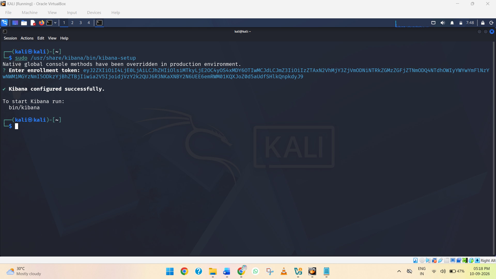

*Figure 18: Kibana setup process showing the enrollment token being entered and Kibana successfully enrolled with Elasticsearch.*

**Result:** Kibana was successfully configured and enrolled with Elasticsearch.

---

### Step 19: Enable Kibana to Start Automatically

After successfully enrolling Kibana with Elasticsearch, the Kibana system service was configured to start automatically whenever the Kali Linux system boots.

First, the systemd service configuration was reloaded:

```bash
sudo systemctl daemon-reload
```

Next, Kibana was enabled as a system service:

```bash
sudo systemctl enable kibana.service
```

This ensures that Kibana will automatically start when the Kali Linux virtual machine is restarted.

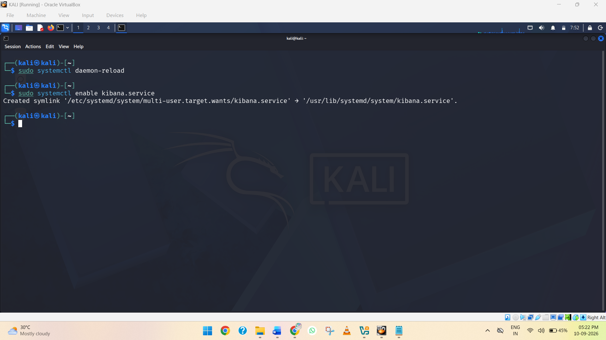

*Figure 19: Kibana successfully enabled as a system service to start automatically with Kali Linux.*

---

### Step 20: Start Kibana

After enabling Kibana as a system service, the Kibana service was started manually using the following command:

```bash
sudo systemctl start kibana.service
```

The status of the service was then checked to verify that Kibana was running successfully:

```bash
sudo systemctl status kibana.service
```

Kibana may take approximately **30–60 seconds** to fully initialize. The service status was checked for:

```text
Active: active (running)
```

The **active (running)** status confirms that Kibana started successfully and is running on the Kali Linux system.

**Result:** Kibana was successfully started and is ready for browser-based access and further configuration.

---

### Step 21: Open Kibana in the Browser

After confirming that the Kibana service was running successfully, the Kibana web interface was accessed through a web browser on the Kali Linux virtual machine.

The following address was entered in the browser:

```text
http://localhost:5601
```

The **Kibana login page** was displayed, requesting authentication with the built-in **`elastic`** user.

**Username:**

```text
elastic
```

**Password:**

The password generated for the **`elastic`** user during the password reset performed in **Step 12** was entered.

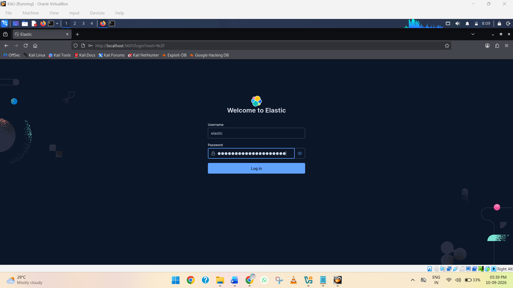

*Figure 21: Kibana login page displayed in the browser, requesting authentication with the built-in **`elastic`** user.*

After entering the correct credentials, the authentication was successful and the **Kibana web interface** was displayed.

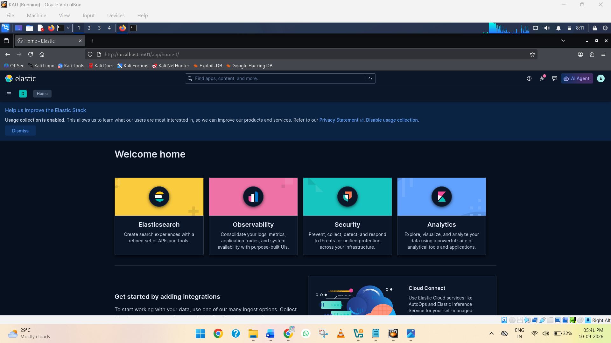

*Figure 22: Kibana web interface successfully opened after authentication, confirming that Kibana is accessible and ready for further configuration.*

**Result:** Kibana was successfully accessed through the browser and the **`elastic`** user authentication was completed successfully.

---

### Step 22: Open Fleet

After successfully logging in to Kibana, the main Kibana navigation menu was opened to access **Fleet**. Fleet is used to manage **Elastic Agents**, configure **Agent Policies**, and manage endpoint integrations.

The following navigation path was used:

**☰ Menu → Management → Fleet**

The **Fleet** page provides the management interface required to configure the Elastic Agent and create the Agent Policy that will later be used for the Windows 11 endpoint.

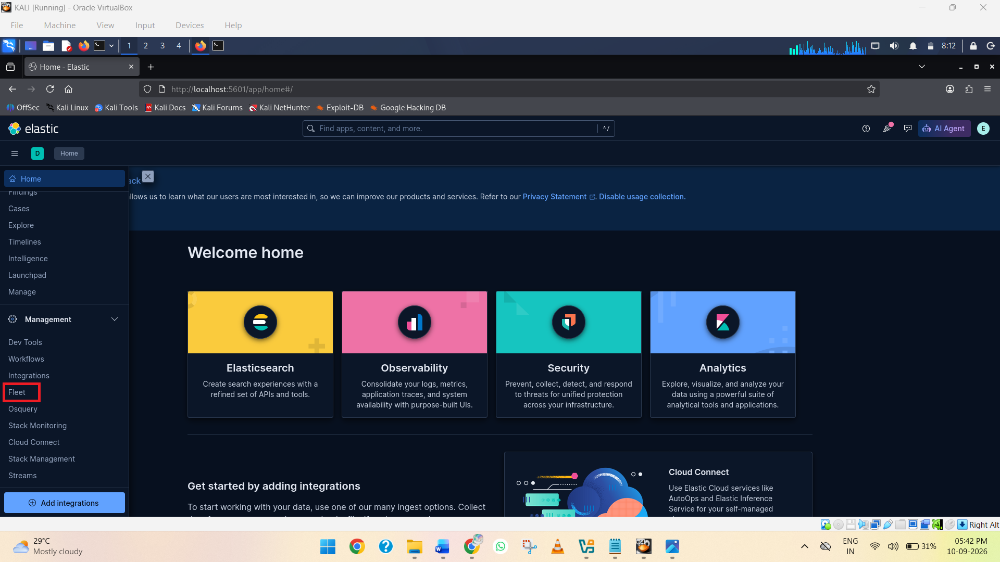

*Figure 23: Kibana navigation panel displaying the **Fleet** option under **Management**.*

**Result:** The Fleet management interface was successfully accessed and is ready for Fleet Server and Elastic Agent configuration.

---

### Step 23: Add the Fleet Encryption Key

Although Elasticsearch and Kibana were configured and running successfully, Fleet requires an **encrypted saved objects encryption key** to securely store sensitive Fleet-related information.

Open the Kibana configuration file using:

```bash
sudo nano /etc/kibana/kibana.yml
```

Add the following line at the bottom of the file:

```yaml
xpack.encryptedSavedObjects.encryptionKey: "kali-elastic-soc-lab-encryption-key-2026"
```

The encryption key must be **at least 32 characters long**.

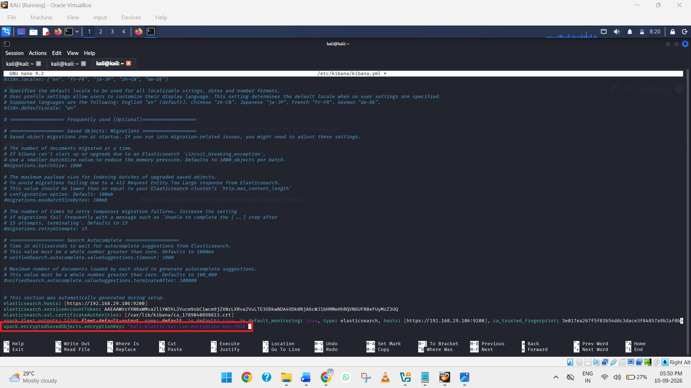

*Figure 24: Kibana configuration file showing the `xpack.encryptedSavedObjects.encryptionKey` configured in `kibana.yml`.*

Save the configuration file using:

**Ctrl + O → Enter → Ctrl + X**

This configures the encryption key required by Fleet to securely manage encrypted saved objects.

**Result:** The Fleet encryption key was successfully added to `kibana.yml`, completing the required encryption configuration for Fleet.

---

### Step 24: Restart Kibana and Access Fleet

After adding the Fleet encryption key to the Kibana configuration, the Kibana service was restarted to apply the new configuration.

Run the following command:

```bash
sudo systemctl restart kibana
```

Wait approximately **30–60 seconds** for Kibana to fully restart. The service status can be verified using:

```bash
sudo systemctl status kibana
```

Once Kibana is running, refresh the browser and access the Kibana web interface:

```text
http://localhost:5601
```

Log in using the **`elastic`** user credentials:

- **Username:** `elastic`
- **Password:** The configured `elastic` user password

After successful authentication, navigate to:

**☰ Menu → Management → Fleet**

The Fleet management page should now display the **Add Fleet Server** option, indicating that Fleet is ready for the next stage of configuration.

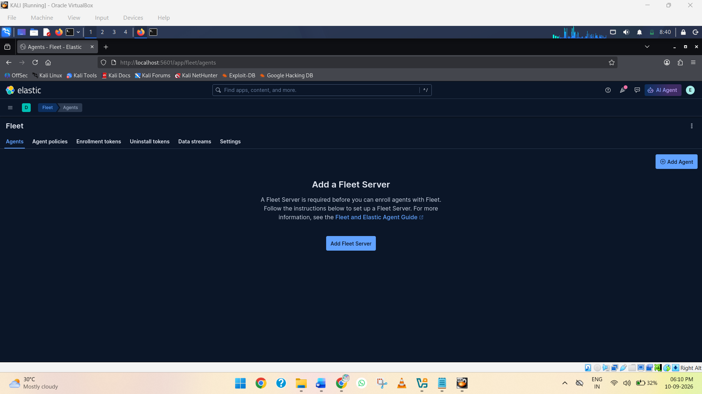

*Figure 25: Fleet management interface displaying the **Add Fleet Server** option, confirming that Fleet is successfully enabled and ready for Fleet Server configuration.*

**Result:** Kibana was successfully restarted with the new encryption configuration, and the Fleet management interface was accessed successfully.

---

### Step 25: Add a Fleet Server

The **Add a Fleet Server** option was selected to begin configuring Fleet Server for the Elastic SIEM lab.

On the **Add a Fleet Server** page, **Quick Start** was selected. A new Fleet Server policy was created with the following configuration:

- **Policy Name:** `SOC-Lab-Fleet-Server`
- **Other Settings:** Kept at their default values
- **Fleet Server URL:** `https://192.168.29.106:8220`

The following ports were used in the Elastic Stack deployment:

- **9200** → Elasticsearch
- **5601** → Kibana
- **8220** → Fleet Server

The communication flow for the lab environment is:

```text
Windows 11 Elastic Agent
        ↓
https://192.168.29.106:8220
        ↓
Fleet Server (Kali Linux)
        ↓
Elasticsearch :9200
        ↓
Kibana :5601
```

After completing the Fleet Server configuration, Kibana confirmed that the **Fleet Server policy** was created successfully. The required service token was generated, and the Fleet Server host was configured as:

```text
https://192.168.29.106:8220
```

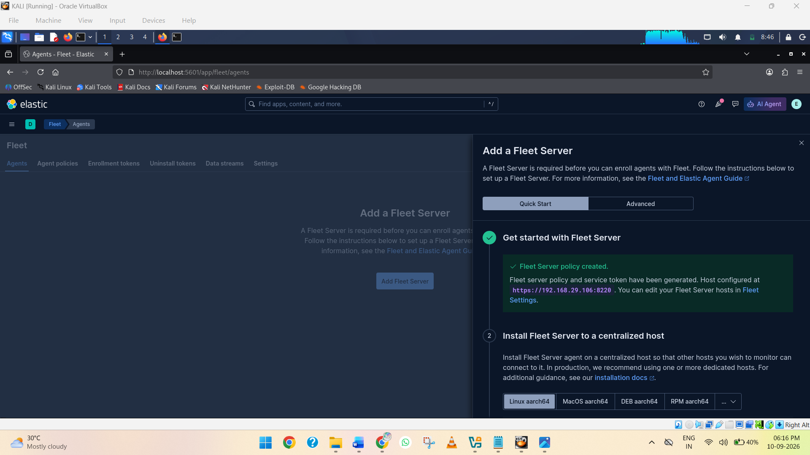

*Figure 26: Fleet Server policy successfully created and configured with the Kali Linux Fleet Server endpoint.*

**Result:** The `SOC-Lab-Fleet-Server` policy was successfully created, and the Fleet Server host and service token were generated. The next stage is to install and start Fleet Server on the Kali Linux machine.

---

### Step 26: Download the Correct Elastic Agent

Before downloading the Elastic Agent, the Kali Linux system architecture was checked to ensure that the correct package was selected.

Run:

```bash
uname -m
```

The command should return:

```text
x86_64
```

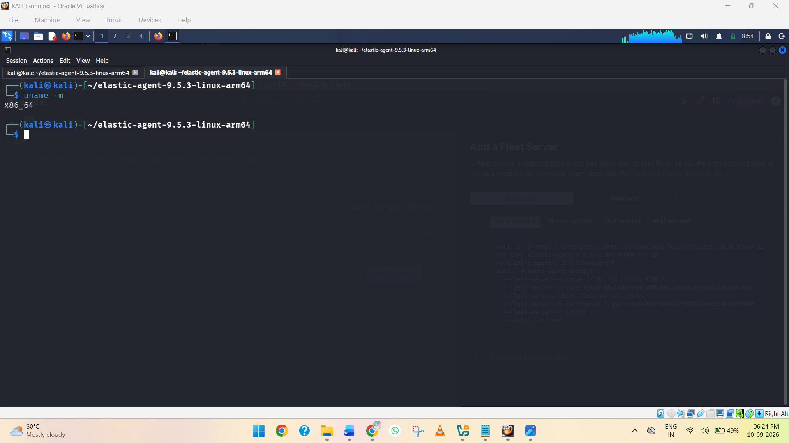

*Figure 27: Kali Linux Terminal displaying the system architecture as `x86_64`.*

Next, return to the **Fleet → Add a Fleet Server** page and select the appropriate options:

* **Operating system:** Linux
* **Architecture:** x86_64
* **Version:** 9.5.3

The download package should be similar to:

```text
elastic-agent-9.5.3-linux-x86_64.tar.gz
```

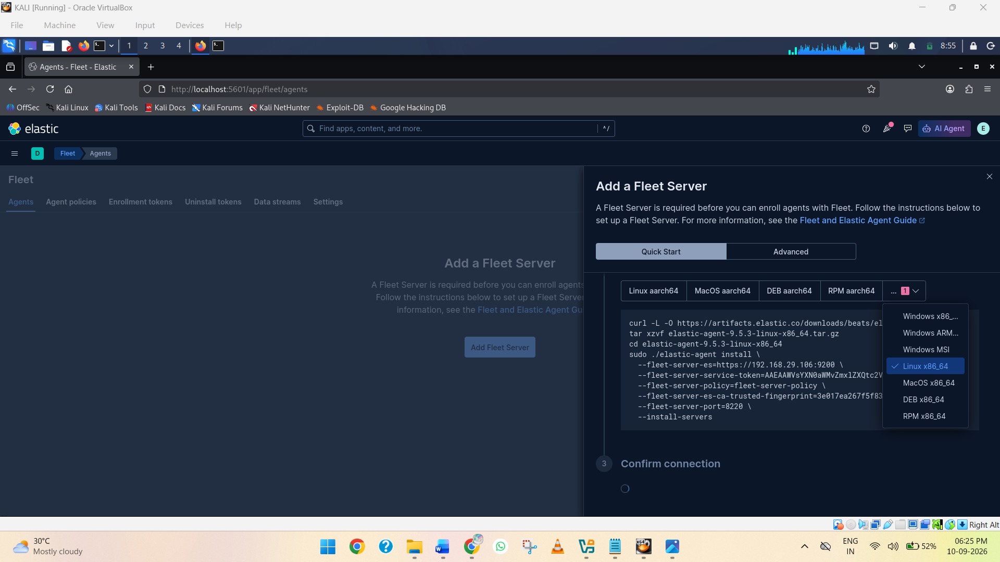

*Figure 28: Fleet **Add a Fleet Server** page showing Linux, x86_64, and Elastic Agent version 9.5.3.*

After selecting the correct package, click **Save and continue** / **Continue** to proceed with the Fleet Server installation.

---

### Step 27: Run the Fleet Server Installation Command

Return to the **Fleet → Add a Fleet Server** page and copy the **Linux x86_64 Fleet Server installation command** provided by Kibana.

Run the copied command in the Kali Linux Terminal to install and enroll the Elastic Agent as a **Fleet Server**.

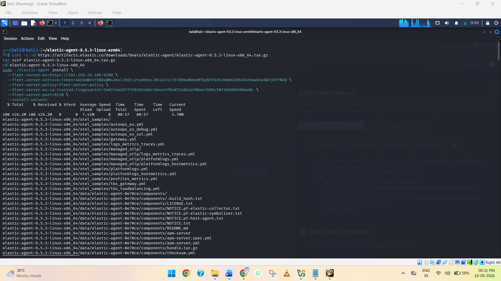

*Figure 29: Fleet page displaying the Linux x86_64 Fleet Server installation command used to install and enroll the Elastic Agent on Kali Linux.*

---

### Step 28: Verify the Elastic Agent Service

The Elastic Agent service was further verified using the following command:

```bash
sudo systemctl status elastic-agent --no-pager
```

The expected output should show:

```text
Active: active (running)
```

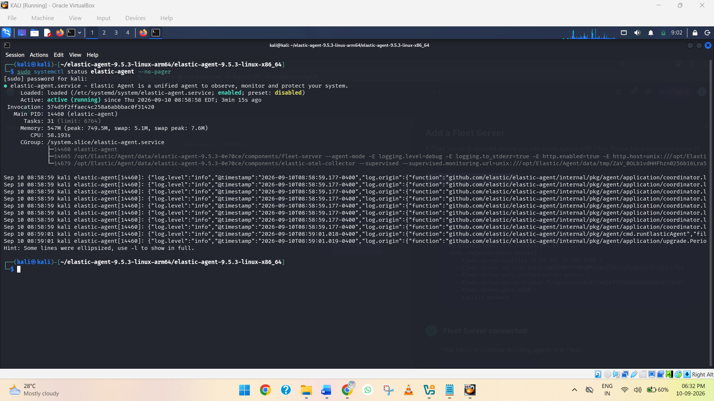

*Figure 30: Terminal displaying the Elastic Agent service status as `Active: active (running)`.*

Next, Fleet Server was verified to be listening on port **8220** using:

```bash
sudo ss -tulpn | grep 8220
```

Port **8220** is the communication port used by Fleet Server for Elastic Agent management and communication.

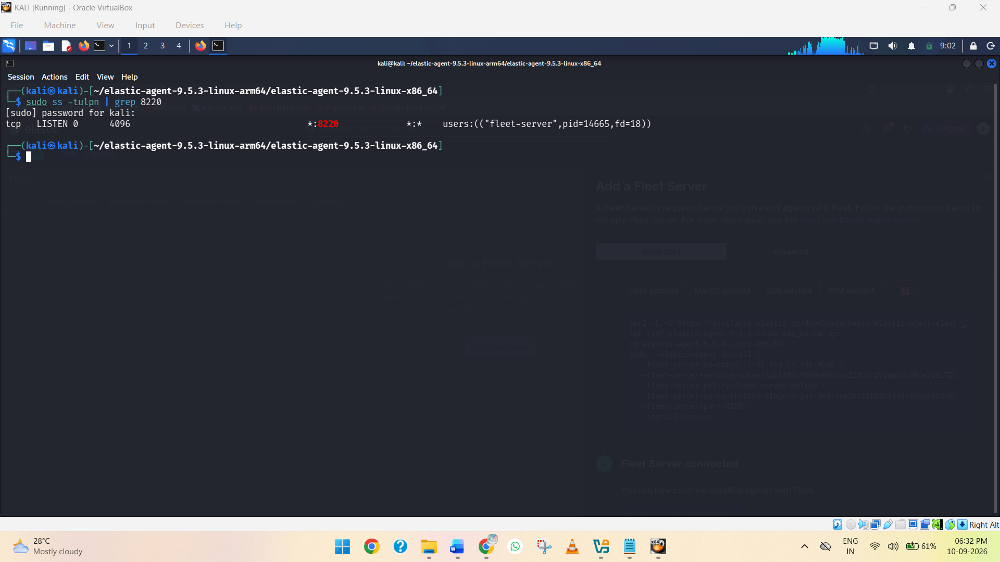

*Figure 31: Terminal output showing Fleet Server actively listening on port 8220.*

These checks confirm that the **Elastic Agent service is running and Fleet Server is actively listening on port 8220**.

---

### Step 29: Check Fleet in Kibana

After installing and starting Fleet Server, its status was verified from the Kibana Fleet interface.

Navigate to:

**Kibana → Fleet → Agents**

The Kali Linux machine should be listed as a **Fleet Server/Agent**. Its status should ideally appear as:

**Healthy 🟢**

A **Healthy** status confirms that the Fleet Server is successfully enrolled, running, and communicating with Kibana and Elasticsearch.

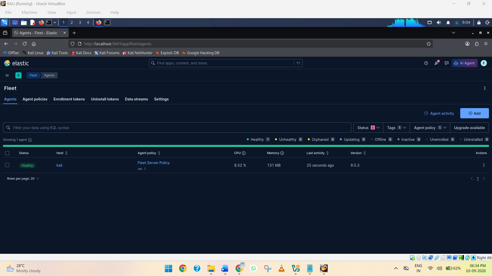

*Figure 32: Fleet Agents page confirming that the Kali Linux Fleet Server is healthy and successfully enrolled.*

**Result:** Fleet Server setup was completed successfully.

---

### Step 30: Add the Windows 11 VM

The Windows 11 virtual machine was added to Fleet so that Elastic can collect and monitor **Windows Security, System, and Application logs**.

In Kibana, navigate to:

**☰ Menu → Fleet → Agents → Add agent**

Select:

**Enroll in Fleet**

Under **Agent policy**, select an existing endpoint policy. If a suitable policy does not exist, create a new policy with the following details:

* **Agent policy name:** Windows-SOC-Lab
* **Description:** Windows 11 endpoint monitoring for SOC lab

Then click **Create agent policy**.

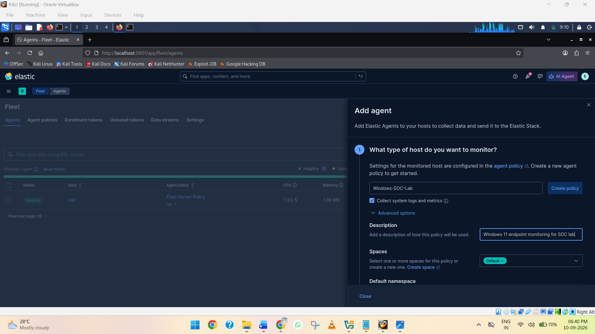

*Figure 33: Kibana Fleet Add agent page showing the Windows-SOC-Lab agent policy being created.*

---

### Step 31: Add Windows Integration

After creating the Windows agent policy, the **Windows integration** was added to enable the collection of Windows event logs.

Navigate to:

**Kibana → Fleet → Agent policies**

Open the newly created **Windows-SOC-Lab** policy and click:

**Add integration**

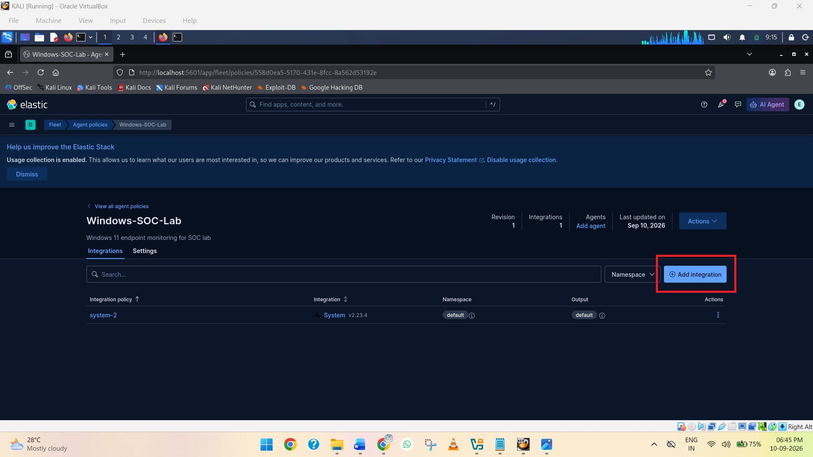

*Figure 34: Windows-SOC-Lab agent policy page showing the Add integration option.*

Search for **Windows** and select the **Windows integration** from the available integrations.

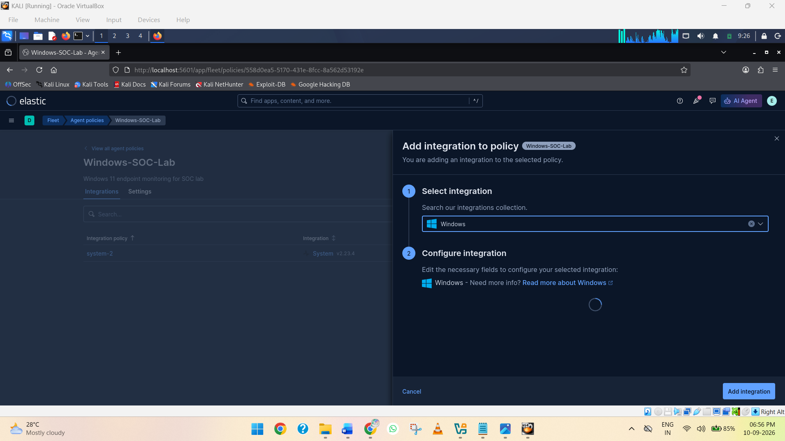

*Figure 35: Kibana Integration page displaying the Windows integration option in the search results.*

Click **Add Windows** / **Add integration** to add the integration to the policy.

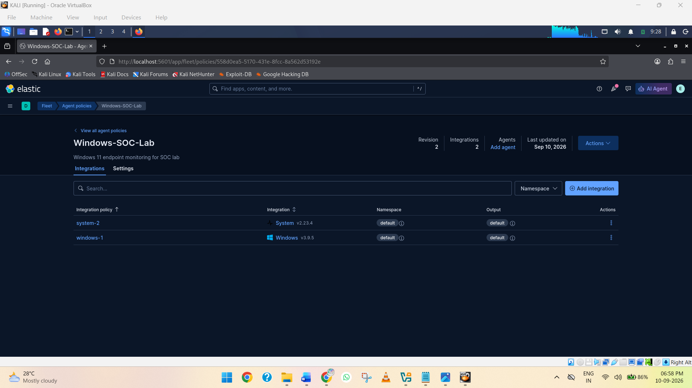

*Figure 36: Windows-SOC-Lab agent policy showing the Windows integration successfully added.*

**Result:** The Windows agent policy was created and configured with the Windows integration, preparing the policy to collect Windows endpoint logs.

---

### Step 32: Add the Windows Agent

The Windows 11 virtual machine was connected to Fleet by installing the **Elastic Agent** and enrolling it with the **Windows-SOC-Lab** agent policy.

In Kibana, navigate to:

**Fleet → Agents → Add agent**

Select **Windows** and, under **Agent policy**, select:

**Windows-SOC-Lab**

Kibana then displays the **PowerShell installation command** required to install and enroll the Elastic Agent.

**Open the Windows 11 VM**

The Windows 11 virtual machine was opened in **VMware Workstation**.


*Figure 37: Windows 11 virtual machine running in VMware Workstation.*

Open Windows 11 and launch **PowerShell as Administrator**.

Copy and run the PowerShell installation command provided by Kibana.

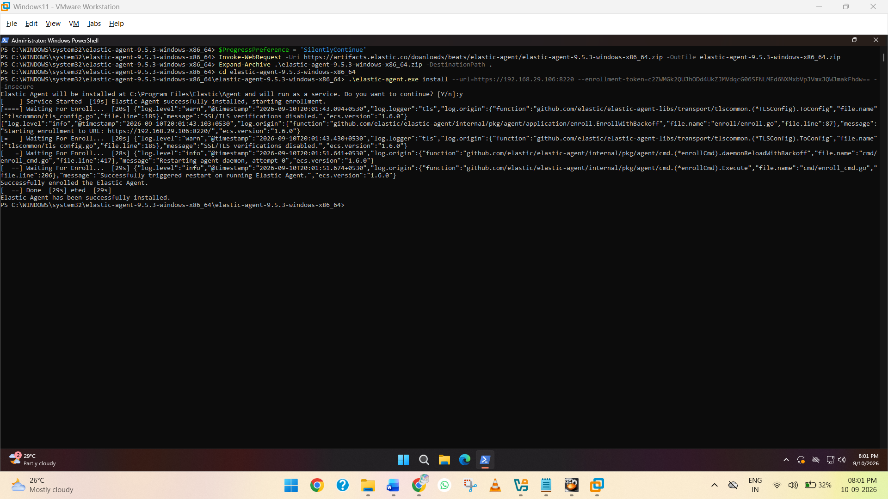

*Figure 38: Windows 11 PowerShell showing the Elastic Agent installation and enrollment completed successfully.*

The Elastic Agent installation was then verified from the Kali Linux/Kibana Fleet environment.

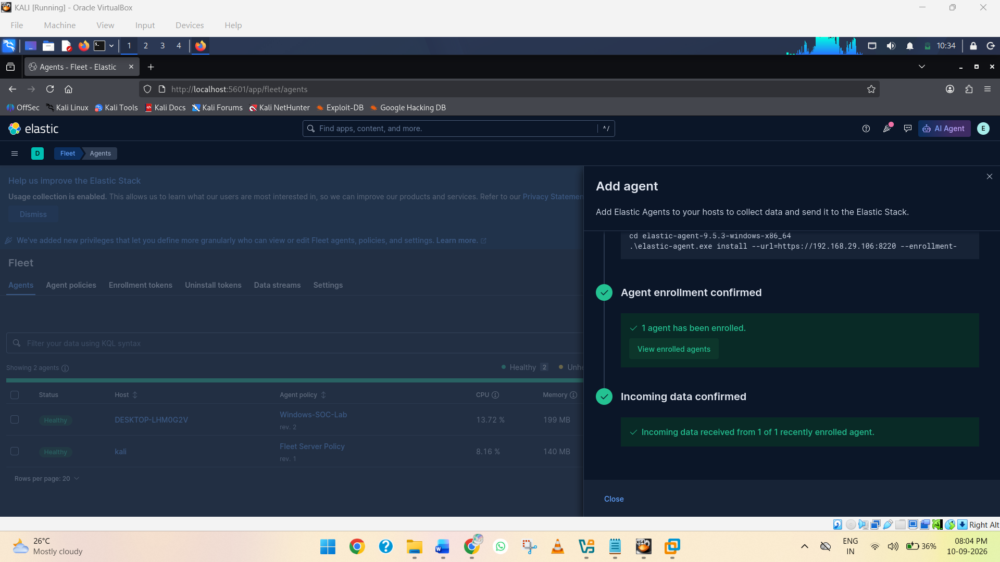

*Figure 39: Kali Linux/Kibana environment showing the Windows Elastic Agent successfully enrolled with Fleet.*

**Result:** The Elastic Agent was successfully installed on the Windows 11 virtual machine and enrolled with the **Windows-SOC-Lab** agent policy in Fleet.

---

### Step 33: Verify the Windows Agent in Kibana

After installing the Elastic Agent on the Windows 11 VM, its enrollment and health status were verified in Kibana.

Navigate to:

**Kibana → ☰ Menu → Fleet → Agents**

The Windows 11 virtual machine should be displayed with:

* **Status:** Healthy 🟢
* **Policy:** Windows-SOC-Lab

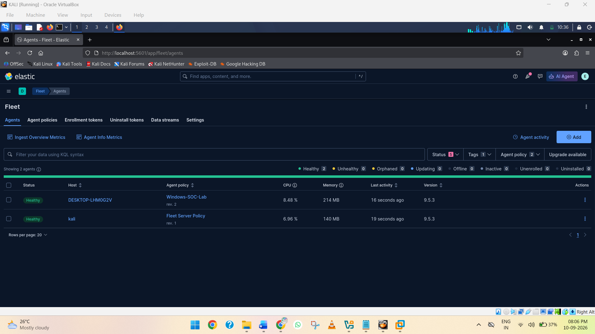

*Figure 40: Kibana Fleet → Agents page showing the Windows 11 VM with Healthy status and Windows-SOC-Lab policy.*

A **Healthy** status confirms that the Windows 11 Elastic Agent is successfully enrolled and communicating with the Fleet Server.

The basic Elastic Stack architecture is now:

```text
Windows 11 VM
      │
      │ Elastic Agent
      ▼
Fleet Server (Kali)
      │
      ▼
Elasticsearch
      │
      ▼
Kibana
```

**Result:** The Windows 11 endpoint was successfully enrolled in Fleet, and the Elastic Agent was confirmed to be healthy.

---

### Step 34: Verify Windows Logs in Discover

After enrolling the Windows 11 Elastic Agent, the collected Windows logs were verified in Kibana **Discover**.

Navigate to:

**Kibana → ☰ Menu → Discover**

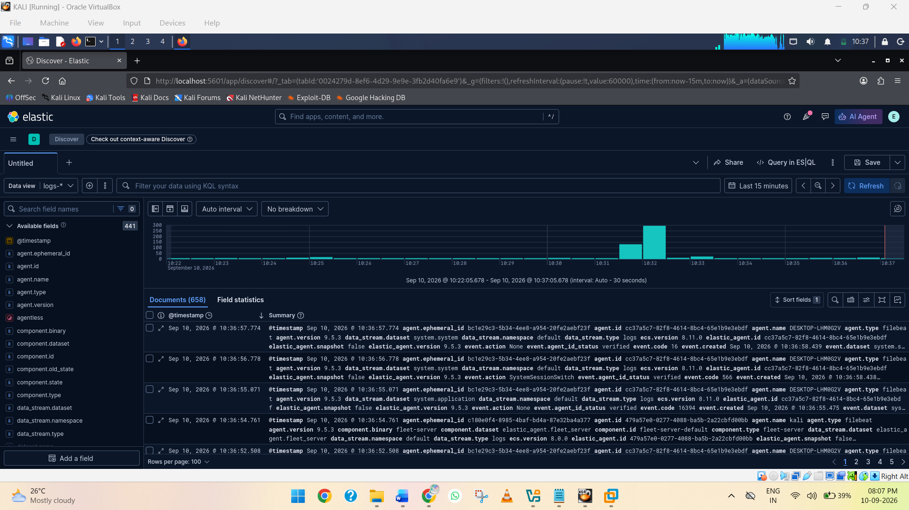

*Figure 41: Kibana Discover showing Windows logs received from the Windows 11 endpoint.*

Review the returned events and locate the **host.name** field. It should display the hostname of the Windows 11 VM.

For this lab, the Windows hostname is:

```text
host.name: DESKTOP-LHM0G2V
```

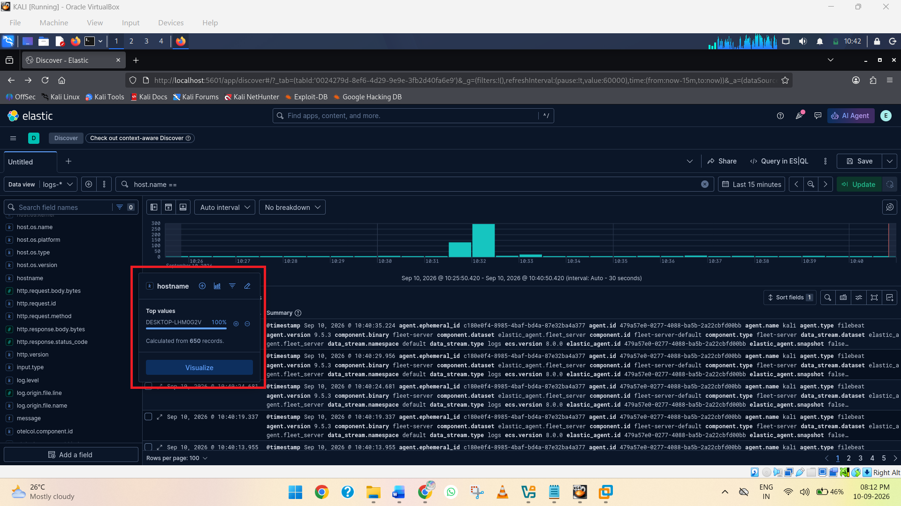

*Figure 42: Kibana Discover showing Windows Security logs with `host.name: DESKTOP-LHM0G2V`.*

The **host.os.name** field can also be checked to identify the operating system. It should display the Windows operating system name, such as:

```text
Microsoft Windows 11 Enterprise
```

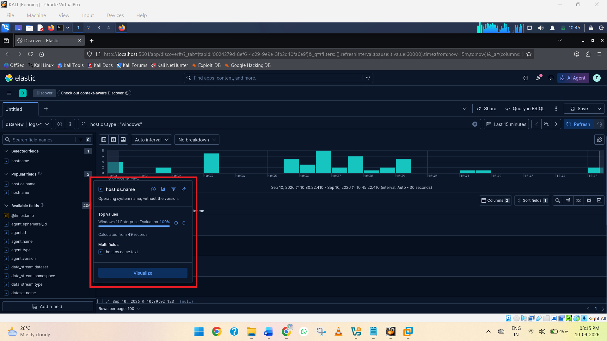

*Figure 43: Kibana Discover showing the `host.os.name` field as Microsoft Windows 11 Enterprise.*

The **host.os.type** field can be used to confirm that the events originated from a Windows system:

```text
windows
```

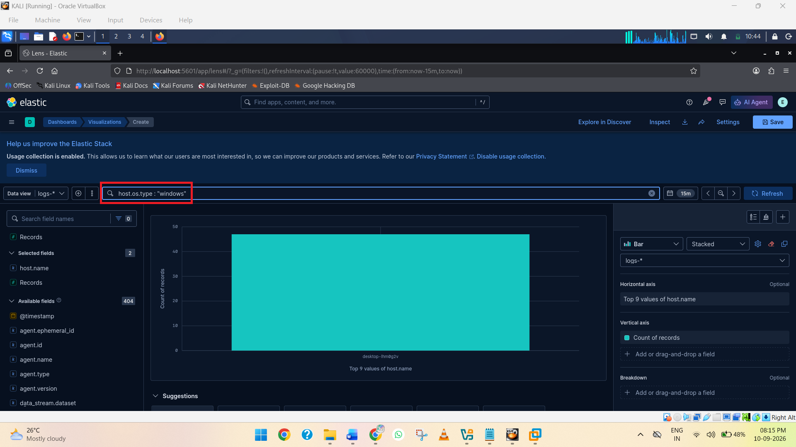

*Figure 44: Kibana Discover showing `host.os.type: windows`.*

A combined visualization or Discover view can also be used to demonstrate that logs are being received from both the **Windows 11 VM** and the **Kali Linux** system.

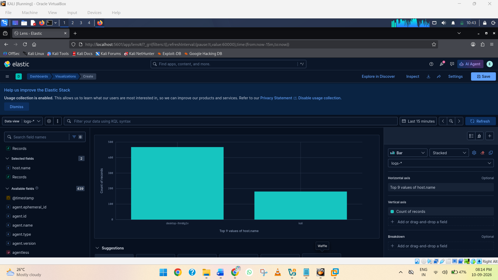

*Figure 45: Kibana Discover visualization showing logs received from both the Windows 11 VM and Kali Linux.*

**Result:** Windows event logs were successfully received and verified in Kibana Discover. The `host.name`, `host.os.name`, and `host.os.type` fields confirmed that the events originated from the Windows 11 endpoint.

---

## Project Implementation Conclusion

The project implementation was successfully completed by deploying an **Elastic SIEM environment** using **Kali Linux** as the central security monitoring platform and **Windows 11** as the monitored endpoint.

The implementation covered the installation and configuration of **Elasticsearch**, **Kibana**, and **Fleet Server**, followed by the enrollment and management of an **Elastic Agent** on the Windows 11 endpoint.

The completed lab provides a centralized environment for collecting, managing, and analyzing Windows security telemetry through the Elastic Stack. This implementation demonstrates practical experience with **SIEM deployment, Fleet management, endpoint monitoring, log collection, and security event analysis**.

**Implementation Status:** Successfully Completed

## 🧠 Skills Earned

- **SIEM Deployment & Configuration** — Elasticsearch, Kibana, Fleet Server
- **Security Monitoring** — Windows endpoint monitoring and security telemetry
- **Log Collection & Analysis** — Windows Security, System, and Application logs
- **Fleet & Elastic Agent Management** — Agent enrollment, policies, and endpoint management
- **Incident Detection & Investigation** — Security event analysis and log investigation
- **Kibana Discover** — Searching, filtering, and analyzing security events
- **Linux Administration** — Service management and Elastic Stack configuration on Kali Linux
- **Windows Security Monitoring** — Collection and analysis of Windows endpoint events
- **Network & SIEM Architecture** — Understanding communication between Elastic Agent, Fleet Server, Elasticsearch, and Kibana
- **Troubleshooting & System Validation** — Verifying services, connectivity, agent health, and log ingestion

## 🔑 Key Learnings

This project provided practical experience in deploying and configuring a basic **Elastic SIEM environment** and understanding how endpoint telemetry is centralized for security monitoring. It demonstrated the role of **Elasticsearch** as the central data storage and indexing component, **Kibana** as the visualization and analysis platform, and **Fleet Server** and **Elastic Agent** as the endpoint management and data collection components.

The project also provided an understanding of how **Windows Security, System, and Application events** can be collected from a Windows 11 endpoint and made available through a centralized SIEM platform. Configuring **Fleet Server, Agent Policies, and Windows integrations** helped develop an understanding of communication between the endpoint and the Elastic Stack.

The verification process using **Fleet** and **Kibana Discover** demonstrated how security analysts can monitor enrolled endpoints, verify agent health, examine collected telemetry, and search security events for monitoring and investigation.

## ✅ Conclusion

The project successfully demonstrated the implementation of a basic **SIEM lab using the Elastic Stack**. **Elasticsearch** was configured as the centralized data storage and indexing platform, while **Kibana** was used for visualization and security event analysis. **Fleet Server** and **Elastic Agent** were configured to manage and collect telemetry from a **Windows 11 endpoint**.

The successful enrollment and healthy status of the Windows endpoint in **Fleet**, along with the successful collection of Windows security telemetry in **Kibana Discover**, confirmed that the endpoint monitoring and log collection process was working successfully.

Overall, the project provided valuable hands-on experience with **SIEM deployment, centralized log collection, Windows endpoint monitoring, Elastic Stack configuration, Fleet management, and security event analysis**, establishing a practical foundation for further **SOC and security operations activities**.
